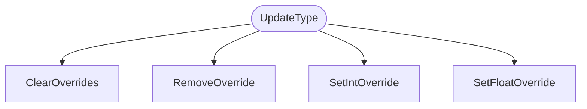

# UpdateType

`enum` - wire `uint8`

```mermaid
flowchart TB
  ROOT(["UpdateType"])
  ROOT --> ClearOverrides["ClearOverrides"]
  ROOT --> RemoveOverride["RemoveOverride"]
  ROOT --> SetIntOverride["SetIntOverride"]
  ROOT --> SetFloatOverride["SetFloatOverride"]
```

