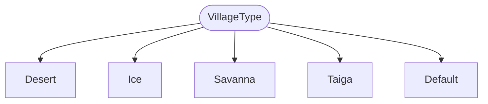

# VillageType

`enum` - wire `uint8`

```mermaid
flowchart TB
  ROOT(["VillageType"])
  ROOT --> Desert["Desert"]
  ROOT --> Ice["Ice"]
  ROOT --> Savanna["Savanna"]
  ROOT --> Taiga["Taiga"]
  ROOT --> Default["Default"]
```

