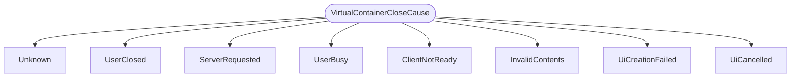

# VirtualContainerCloseCause

`enum` - wire `uint8`

```mermaid
flowchart TB
  ROOT(["VirtualContainerCloseCause"])
  ROOT --> Unknown["Unknown"]
  ROOT --> UserClosed["UserClosed"]
  ROOT --> ServerRequested["ServerRequested"]
  ROOT --> UserBusy["UserBusy"]
  ROOT --> ClientNotReady["ClientNotReady"]
  ROOT --> InvalidContents["InvalidContents"]
  ROOT --> UiCreationFailed["UiCreationFailed"]
  ROOT --> UiCancelled["UiCancelled"]
```

