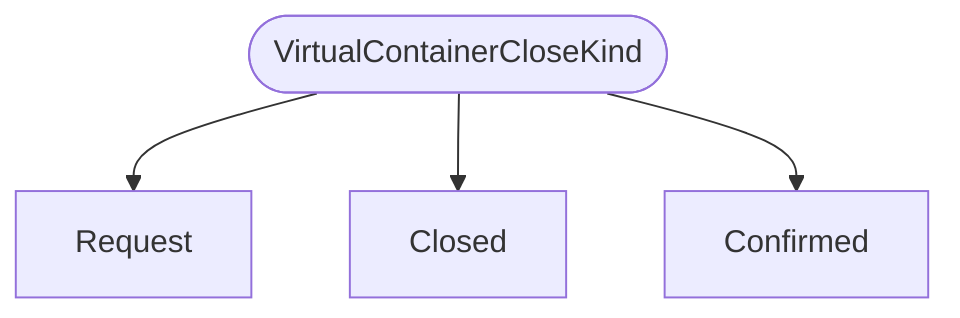

# VirtualContainerCloseKind

`enum` - wire `uint8`

```mermaid
flowchart TB
  ROOT(["VirtualContainerCloseKind"])
  ROOT --> Request["Request"]
  ROOT --> Closed["Closed"]
  ROOT --> Confirmed["Confirmed"]
```

