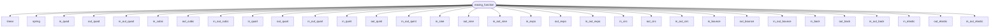

# easing_function

`enum` - wire `uint32`

```mermaid
flowchart TB
  ROOT(["easing_function"])
  ROOT --> linear["linear"]
  ROOT --> spring["spring"]
  ROOT --> in_quad["in_quad"]
  ROOT --> out_quad["out_quad"]
  ROOT --> in_out_quad["in_out_quad"]
  ROOT --> in_cubic["in_cubic"]
  ROOT --> out_cubic["out_cubic"]
  ROOT --> in_out_cubic["in_out_cubic"]
  ROOT --> in_quart["in_quart"]
  ROOT --> out_quart["out_quart"]
  ROOT --> in_out_quart["in_out_quart"]
  ROOT --> in_quint["in_quint"]
  ROOT --> out_quint["out_quint"]
  ROOT --> in_out_quint["in_out_quint"]
  ROOT --> in_sine["in_sine"]
  ROOT --> out_sine["out_sine"]
  ROOT --> in_out_sine["in_out_sine"]
  ROOT --> in_expo["in_expo"]
  ROOT --> out_expo["out_expo"]
  ROOT --> in_out_expo["in_out_expo"]
  ROOT --> in_circ["in_circ"]
  ROOT --> out_circ["out_circ"]
  ROOT --> in_out_circ["in_out_circ"]
  ROOT --> in_bounce["in_bounce"]
  ROOT --> out_bounce["out_bounce"]
  ROOT --> in_out_bounce["in_out_bounce"]
  ROOT --> in_back["in_back"]
  ROOT --> out_back["out_back"]
  ROOT --> in_out_back["in_out_back"]
  ROOT --> in_elastic["in_elastic"]
  ROOT --> out_elastic["out_elastic"]
  ROOT --> in_out_elastic["in_out_elastic"]
```

