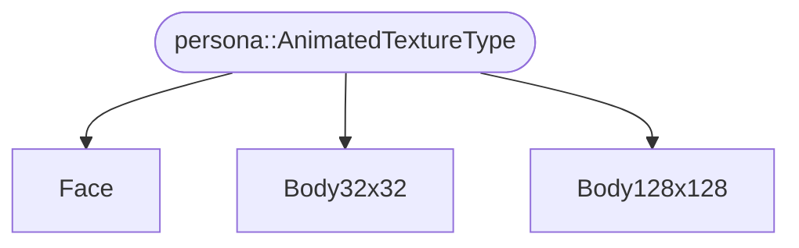

# persona::AnimatedTextureType

`enum` - wire `uint32`

```mermaid
flowchart TB
  ROOT(["persona::AnimatedTextureType"])
  ROOT --> Face["Face"]
  ROOT --> Body32x32["Body32x32"]
  ROOT --> Body128x128["Body128x128"]
```

