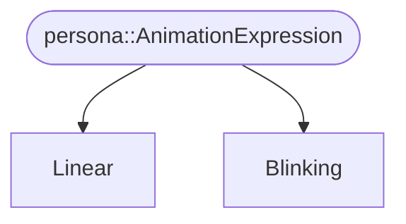

# persona::AnimationExpression

`enum` - wire `uint32`

- protocol: 2168
- minecraft: 1.26.40

```mermaid
flowchart TB
  ROOT(["persona::AnimationExpression"])
  ROOT --> Linear["Linear"]
  ROOT --> Blinking["Blinking"]
```

