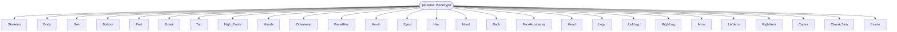

# persona::PieceType

`enum` - wire `uint32`

- protocol: 2168
- minecraft: 1.26.40

```mermaid
flowchart TB
  ROOT(["persona::PieceType"])
  ROOT --> Skeleton["Skeleton"]
  ROOT --> Body["Body"]
  ROOT --> Skin["Skin"]
  ROOT --> Bottom["Bottom"]
  ROOT --> Feet["Feet"]
  ROOT --> Dress["Dress"]
  ROOT --> Top["Top"]
  ROOT --> High_Pants["High_Pants"]
  ROOT --> Hands["Hands"]
  ROOT --> Outerwear["Outerwear"]
  ROOT --> FacialHair["FacialHair"]
  ROOT --> Mouth["Mouth"]
  ROOT --> Eyes["Eyes"]
  ROOT --> Hair["Hair"]
  ROOT --> Hood["Hood"]
  ROOT --> Back["Back"]
  ROOT --> FaceAccessory["FaceAccessory"]
  ROOT --> Head["Head"]
  ROOT --> Legs["Legs"]
  ROOT --> LeftLeg["LeftLeg"]
  ROOT --> RightLeg["RightLeg"]
  ROOT --> Arms["Arms"]
  ROOT --> LeftArm["LeftArm"]
  ROOT --> RightArm["RightArm"]
  ROOT --> Capes["Capes"]
  ROOT --> ClassicSkin["ClassicSkin"]
  ROOT --> Emote["Emote"]
```

