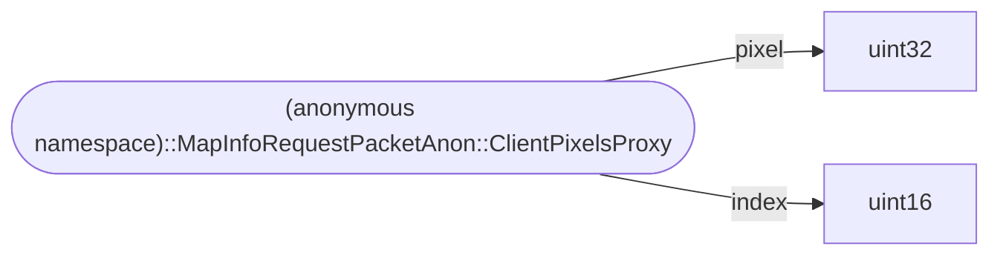

# (anonymous namespace)::MapInfoRequestPacketAnon::ClientPixelsProxy

`packet`

- protocol: 2168
- minecraft: 1.26.40

```mermaid
flowchart LR
  ROOT(["(anonymous namespace)::MapInfoRequestPacketAnon::ClientPixelsProxy"])
  ROOT -->|"pixel"| uint32["uint32"]
  ROOT -->|"index"| uint16["uint16"]
```

