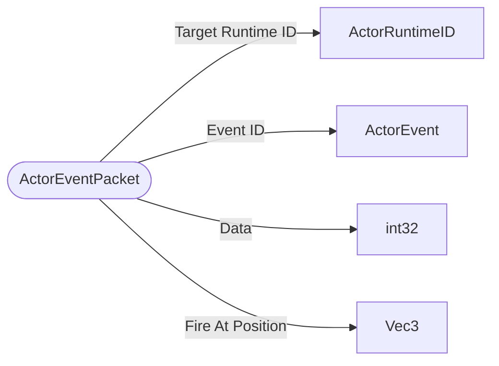

# ActorEventPacket

`packet` - id **27**

Ranges from a crossbow being ready to fire to taming animals..., some of which may be obsolete (frex, ADD_PLAYER_LEVELS)

```mermaid
flowchart LR
  ROOT(["ActorEventPacket"])
  ROOT -->|"Target Runtime ID"| ActorRuntimeID["ActorRuntimeID"]
  ROOT -->|"Event ID"| ActorEvent["ActorEvent"]
  ROOT -->|"Data"| int32["int32"]
  ROOT -->|"Fire At Position"| Vec3["Vec3"]
```

