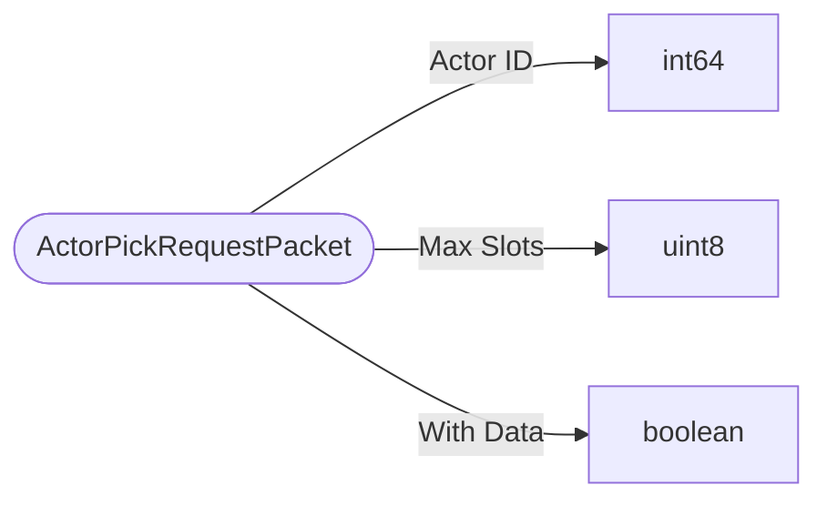

# ActorPickRequestPacket

`packet` - id **35**

```mermaid
flowchart LR
  ROOT(["ActorPickRequestPacket"])
  ROOT -->|"Actor ID"| int64["int64"]
  ROOT -->|"Max Slots"| uint8["uint8"]
  ROOT -->|"With Data"| boolean["boolean"]
```

