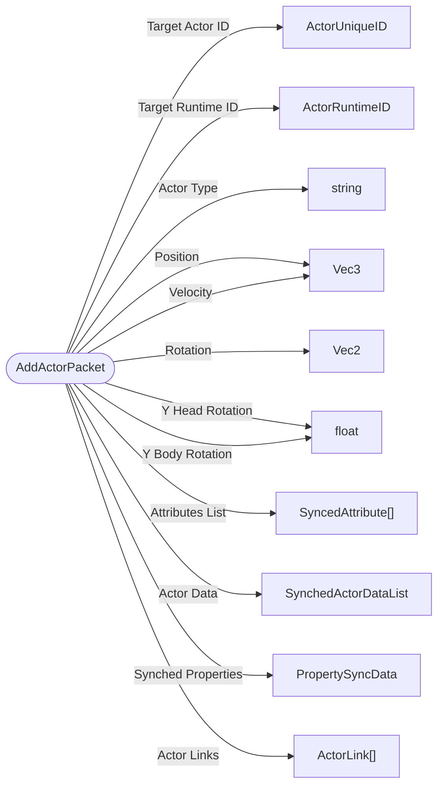

# AddActorPacket

`packet` - id **13**

Newly created entities on server use AddActorPacket to notify clients that they exist.

```mermaid
flowchart LR
  ROOT(["AddActorPacket"])
  ROOT -->|"Target Actor ID"| ActorUniqueID["ActorUniqueID"]
  ROOT -->|"Target Runtime ID"| ActorRuntimeID["ActorRuntimeID"]
  ROOT -->|"Actor Type"| string["string"]
  ROOT -->|"Position"| Vec3["Vec3"]
  ROOT -->|"Velocity"| Vec3["Vec3"]
  ROOT -->|"Rotation"| Vec2["Vec2"]
  ROOT -->|"Y Head Rotation"| float["float"]
  ROOT -->|"Y Body Rotation"| float["float"]
  ROOT -->|"Attributes List"| SyncedAttribute["SyncedAttribute[]"]
  ROOT -->|"Actor Data"| SynchedActorDataList["SynchedActorDataList"]
  ROOT -->|"Synched Properties"| PropertySyncData["PropertySyncData"]
  ROOT -->|"Actor Links"| ActorLink["ActorLink[]"]
```

