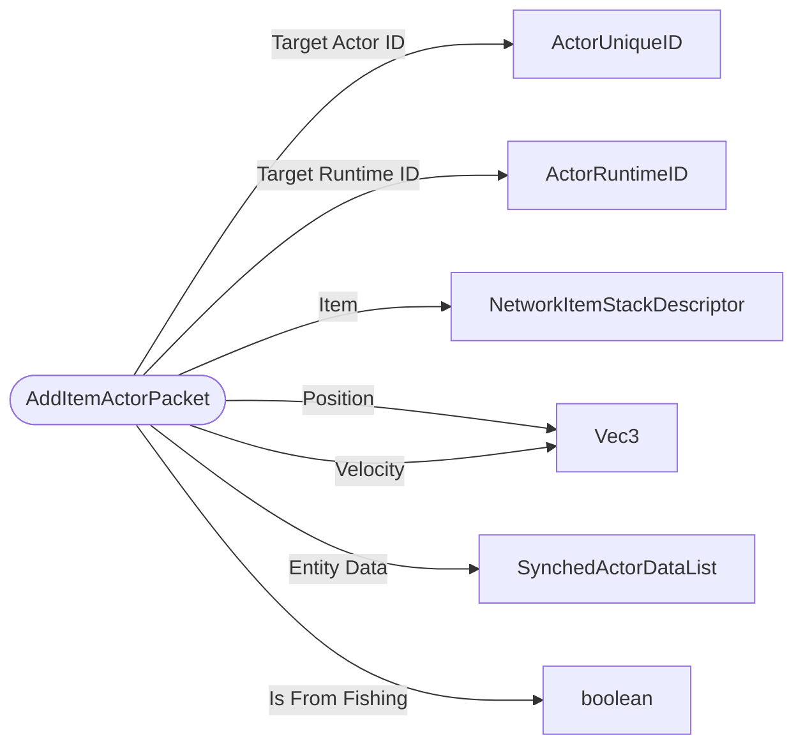

# AddItemActorPacket

`packet` - id **15**

```mermaid
flowchart LR
  ROOT(["AddItemActorPacket"])
  ROOT -->|"Target Actor ID"| ActorUniqueID["ActorUniqueID"]
  ROOT -->|"Target Runtime ID"| ActorRuntimeID["ActorRuntimeID"]
  ROOT -->|"Item"| NetworkItemStackDescriptor["NetworkItemStackDescriptor"]
  ROOT -->|"Position"| Vec3["Vec3"]
  ROOT -->|"Velocity"| Vec3["Vec3"]
  ROOT -->|"Entity Data"| SynchedActorDataList["SynchedActorDataList"]
  ROOT -->|"Is From Fishing"| boolean["boolean"]
```

