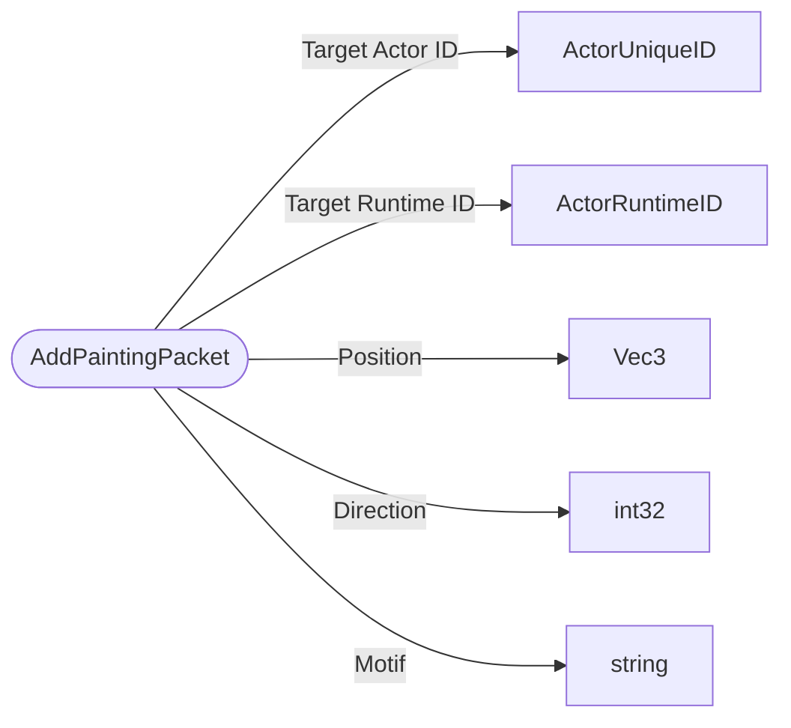

# AddPaintingPacket

`packet` - id **22**

```mermaid
flowchart LR
  ROOT(["AddPaintingPacket"])
  ROOT -->|"Target Actor ID"| ActorUniqueID["ActorUniqueID"]
  ROOT -->|"Target Runtime ID"| ActorRuntimeID["ActorRuntimeID"]
  ROOT -->|"Position"| Vec3["Vec3"]
  ROOT -->|"Direction"| int32["int32"]
  ROOT -->|"Motif"| string["string"]
```

