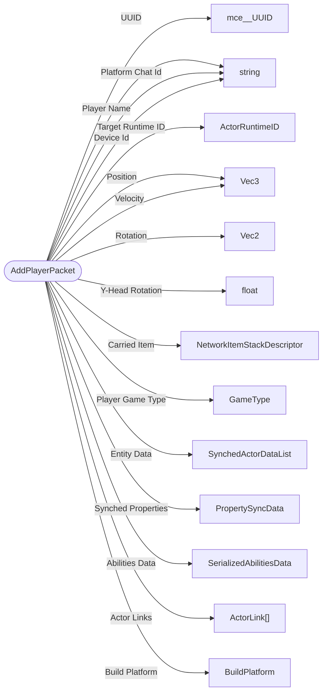

# AddPlayerPacket

`packet` - id **12**

- protocol: 2168
- minecraft: 1.26.40

A new player joins the game; the server sends this packet to the other players.

```mermaid
flowchart LR
  ROOT(["AddPlayerPacket"])
  ROOT -->|"UUID"| mce__UUID["mce__UUID"]
  ROOT -->|"Player Name"| string["string"]
  ROOT -->|"Target Runtime ID"| ActorRuntimeID["ActorRuntimeID"]
  ROOT -->|"Platform Chat Id"| string["string"]
  ROOT -->|"Position"| Vec3["Vec3"]
  ROOT -->|"Velocity"| Vec3["Vec3"]
  ROOT -->|"Rotation"| Vec2["Vec2"]
  ROOT -->|"Y-Head Rotation"| float["float"]
  ROOT -->|"Carried Item"| NetworkItemStackDescriptor["NetworkItemStackDescriptor"]
  ROOT -->|"Player Game Type"| GameType["GameType"]
  ROOT -->|"Entity Data"| SynchedActorDataList["SynchedActorDataList"]
  ROOT -->|"Synched Properties"| PropertySyncData["PropertySyncData"]
  ROOT -->|"Abilities Data"| SerializedAbilitiesData["SerializedAbilitiesData"]
  ROOT -->|"Actor Links"| ActorLink["ActorLink[]"]
  ROOT -->|"Device Id"| string["string"]
  ROOT -->|"Build Platform"| BuildPlatform["BuildPlatform"]
```

