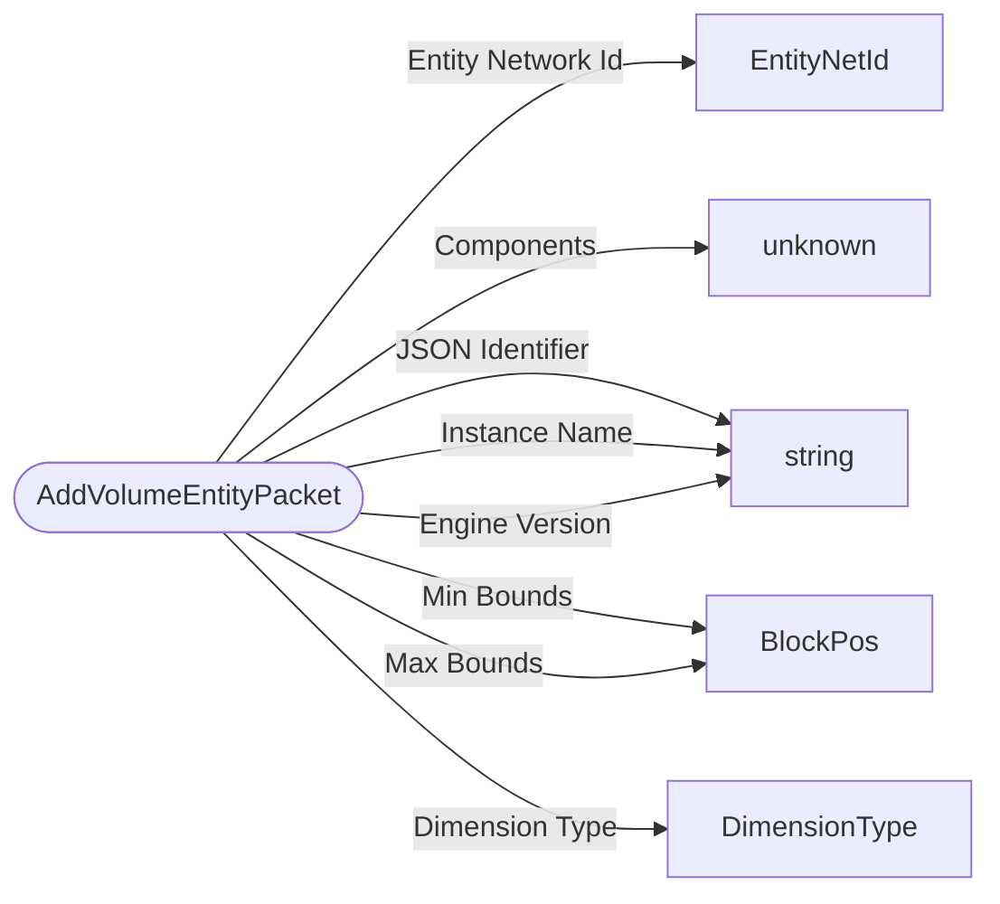

# AddVolumeEntityPacket

`packet` - id **166**

```mermaid
flowchart LR
  ROOT(["AddVolumeEntityPacket"])
  ROOT -->|"Entity Network Id"| EntityNetId["EntityNetId"]
  ROOT -->|"Components"| unknown["unknown"]
  ROOT -->|"JSON Identifier"| string["string"]
  ROOT -->|"Instance Name"| string["string"]
  ROOT -->|"Min Bounds"| BlockPos["BlockPos"]
  ROOT -->|"Max Bounds"| BlockPos["BlockPos"]
  ROOT -->|"Dimension Type"| DimensionType["DimensionType"]
  ROOT -->|"Engine Version"| string["string"]
```

