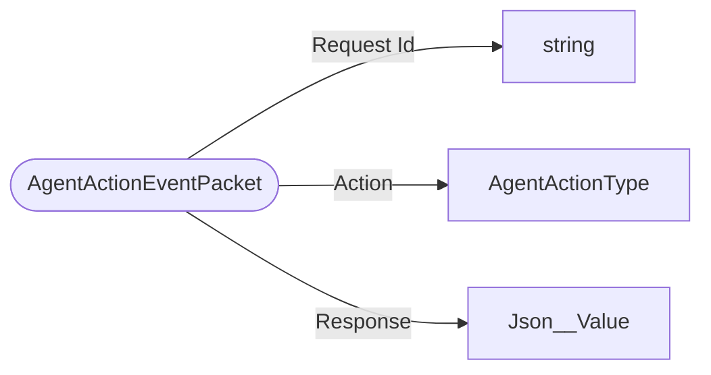

# AgentActionEventPacket

`packet` - id **181**

```mermaid
flowchart LR
  ROOT(["AgentActionEventPacket"])
  ROOT -->|"Request Id"| string["string"]
  ROOT -->|"Action"| AgentActionType["AgentActionType"]
  ROOT -->|"Response"| Json__Value["Json__Value"]
```

