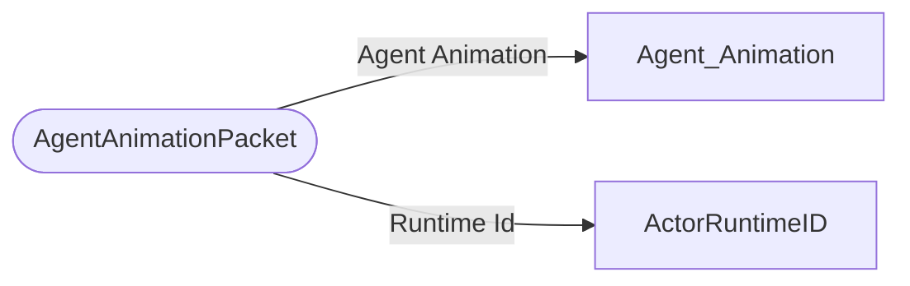

# AgentAnimationPacket

`packet` - id **304**

- protocol: 2168
- minecraft: 1.26.40

```mermaid
flowchart LR
  ROOT(["AgentAnimationPacket"])
  ROOT -->|"Agent Animation"| Agent_Animation["Agent_Animation"]
  ROOT -->|"Runtime Id"| ActorRuntimeID["ActorRuntimeID"]
```

