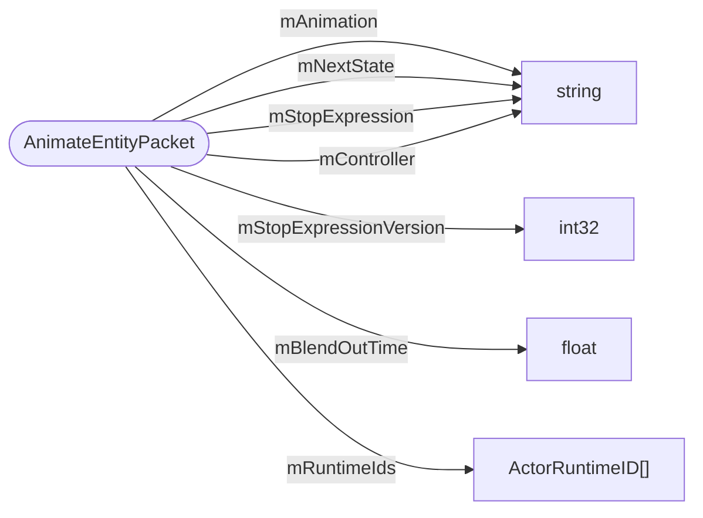

# AnimateEntityPacket

`packet` - id **158**

- protocol: 2168
- minecraft: 1.26.40

Several properties can be specified in the following order: 
	- The name of the animation (a string) that the specified entities are to play. 
	- The next state to transition to (a string) once the specified animation is finished playing. 
	- The stop expression (a string), the condition that determines when to transition to the next state. 
	- The name of an animation controller (a string) that you would like to use. 
	- The blend out time (a float), the amount of time to blend out of this animation. 
	- A vector of ActorRuntimeIds of the entities that will play the specified animation.

