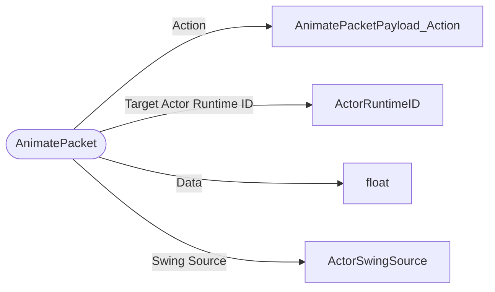

# AnimatePacket

`packet` - id **44**

Combination of server bound and client bound packets to trigger animations.

```mermaid
flowchart LR
  ROOT(["AnimatePacket"])
  ROOT -->|"Action"| AnimatePacketPayload_Action["AnimatePacketPayload_Action"]
  ROOT -->|"Target Actor Runtime ID"| ActorRuntimeID["ActorRuntimeID"]
  ROOT -->|"Data"| float["float"]
  ROOT -->|"Swing Source"| ActorSwingSource["ActorSwingSource"]
```

