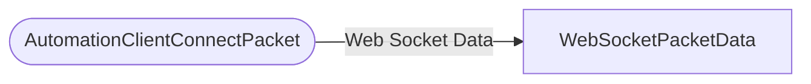

# AutomationClientConnectPacket

`packet` - id **95**

- protocol: 2168
- minecraft: 1.26.40

Only used though command to connect to server URLs. This is primarily used by EDU for connecting to their companion apps and other external applications through web sockets. Some mods/3rd party packs use it as well.

