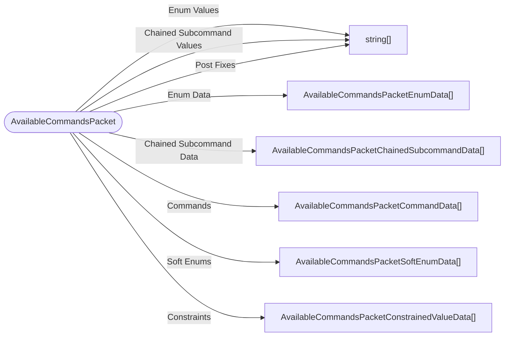

# AvailableCommandsPacket

`packet` - id **76**

- protocol: 2168
- minecraft: 1.26.40

```mermaid
flowchart LR
  ROOT(["AvailableCommandsPacket"])
  ROOT -->|"Enum Values"| string["string[]"]
  ROOT -->|"Chained Subcommand Values"| string["string[]"]
  ROOT -->|"Post Fixes"| string["string[]"]
  ROOT -->|"Enum Data"| AvailableCommandsPacketEnumData["AvailableCommandsPacketEnumData[]"]
  ROOT -->|"Chained Subcommand Data"| AvailableCommandsPacketChainedSubcommandData["AvailableCommandsPacketChainedSubcommandData[]"]
  ROOT -->|"Commands"| AvailableCommandsPacketCommandData["AvailableCommandsPacketCommandData[]"]
  ROOT -->|"Soft Enums"| AvailableCommandsPacketSoftEnumData["AvailableCommandsPacketSoftEnumData[]"]
  ROOT -->|"Constraints"| AvailableCommandsPacketConstrainedValueData["AvailableCommandsPacketConstrainedValueData[]"]
```

