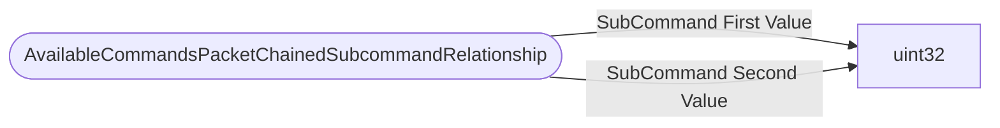

# AvailableCommandsPacketChainedSubcommandRelationship

`packet`

```mermaid
flowchart LR
  ROOT(["AvailableCommandsPacketChainedSubcommandRelationship"])
  ROOT -->|"SubCommand First Value"| uint32["uint32"]
  ROOT -->|"SubCommand Second Value"| uint32["uint32"]
```

