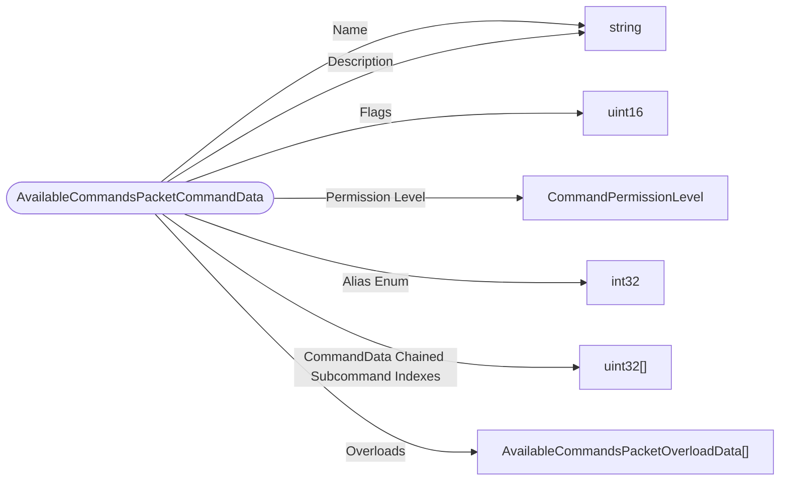

# AvailableCommandsPacketCommandData

`packet`

```mermaid
flowchart LR
  ROOT(["AvailableCommandsPacketCommandData"])
  ROOT -->|"Name"| string["string"]
  ROOT -->|"Description"| string["string"]
  ROOT -->|"Flags"| uint16["uint16"]
  ROOT -->|"Permission Level"| CommandPermissionLevel["CommandPermissionLevel"]
  ROOT -->|"Alias Enum"| int32["int32"]
  ROOT -->|"CommandData Chained Subcommand Indexes"| uint32["uint32[]"]
  ROOT -->|"Overloads"| AvailableCommandsPacketOverloadData["AvailableCommandsPacketOverloadData[]"]
```

