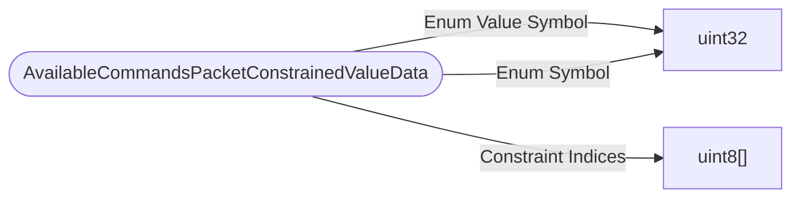

# AvailableCommandsPacketConstrainedValueData

`packet`

```mermaid
flowchart LR
  ROOT(["AvailableCommandsPacketConstrainedValueData"])
  ROOT -->|"Enum Value Symbol"| uint32["uint32"]
  ROOT -->|"Enum Symbol"| uint32["uint32"]
  ROOT -->|"Constraint Indices"| uint8["uint8[]"]
```

