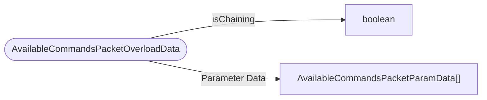

# AvailableCommandsPacketOverloadData

`packet`

- protocol: 2168
- minecraft: 1.26.40

```mermaid
flowchart LR
  ROOT(["AvailableCommandsPacketOverloadData"])
  ROOT -->|"isChaining"| boolean["boolean"]
  ROOT -->|"Parameter Data"| AvailableCommandsPacketParamData["AvailableCommandsPacketParamData[]"]
```

