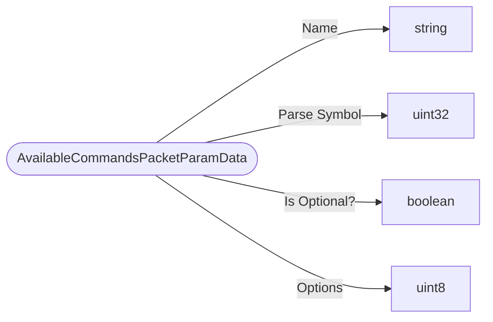

# AvailableCommandsPacketParamData

`packet`

```mermaid
flowchart LR
  ROOT(["AvailableCommandsPacketParamData"])
  ROOT -->|"Name"| string["string"]
  ROOT -->|"Parse Symbol"| uint32["uint32"]
  ROOT -->|"Is Optional?"| boolean["boolean"]
  ROOT -->|"Options"| uint8["uint8"]
```

