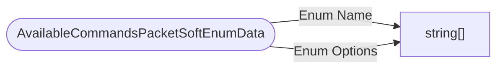

# AvailableCommandsPacketSoftEnumData

`packet`

```mermaid
flowchart LR
  ROOT(["AvailableCommandsPacketSoftEnumData"])
  ROOT -->|"Enum Name"| string["string"]
  ROOT -->|"Enum Options"| string["string[]"]
```

