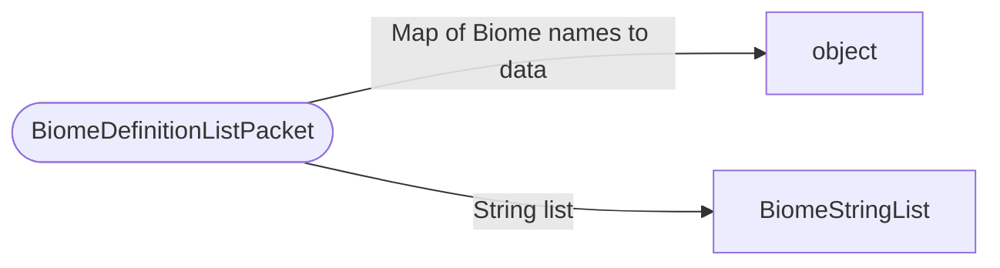

# BiomeDefinitionListPacket

`packet` - id **122**

- protocol: 2168
- minecraft: 1.26.40

- mBiomeData: map of biome string indices to biome definition data.
- mStringList: list of biome name strings.

