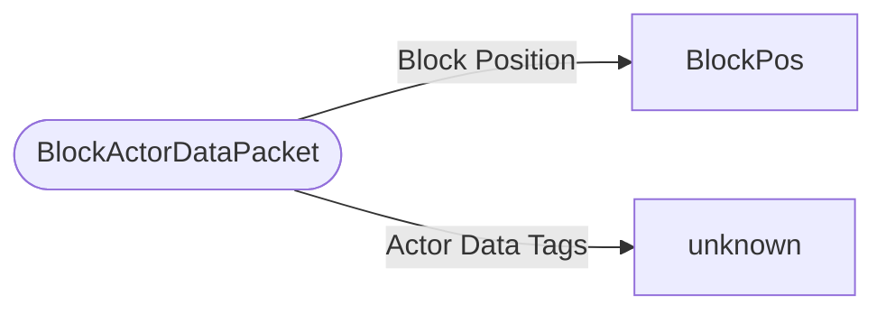

# BlockActorDataPacket

`packet` - id **56**

- protocol: 2168
- minecraft: 1.26.40

```mermaid
flowchart LR
  ROOT(["BlockActorDataPacket"])
  ROOT -->|"Block Position"| BlockPos["BlockPos"]
  ROOT -->|"Actor Data Tags"| unknown["unknown"]
```

