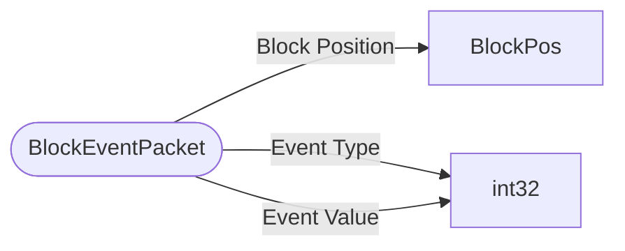

# BlockEventPacket

`packet` - id **26**

```mermaid
flowchart LR
  ROOT(["BlockEventPacket"])
  ROOT -->|"Block Position"| BlockPos["BlockPos"]
  ROOT -->|"Event Type"| int32["int32"]
  ROOT -->|"Event Value"| int32["int32"]
```

