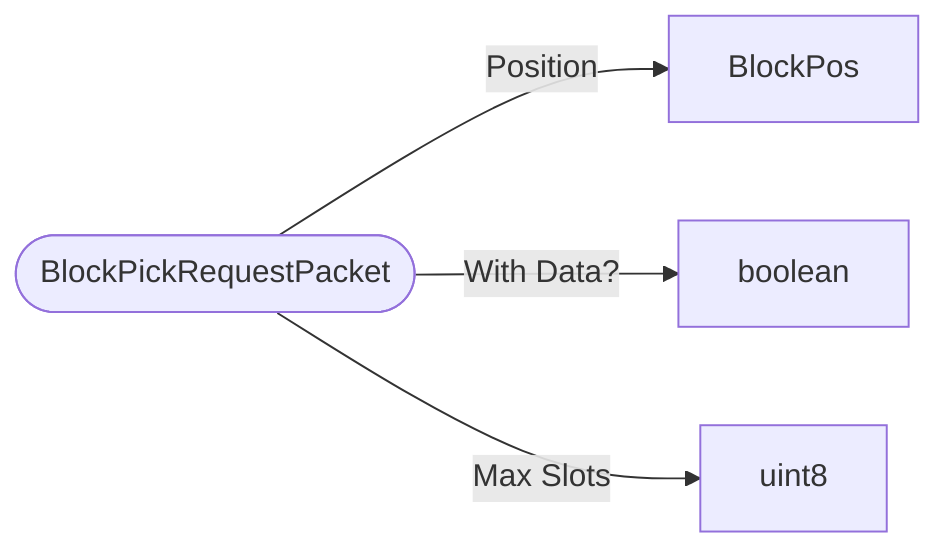

# BlockPickRequestPacket

`packet` - id **34**

- protocol: 2168
- minecraft: 1.26.40

```mermaid
flowchart LR
  ROOT(["BlockPickRequestPacket"])
  ROOT -->|"Position"| BlockPos["BlockPos"]
  ROOT -->|"With Data?"| boolean["boolean"]
  ROOT -->|"Max Slots"| uint8["uint8"]
```

