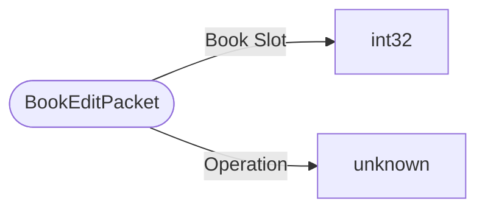

# BookEditPacket

`packet` - id **97**

- protocol: 2168
- minecraft: 1.26.40

```mermaid
flowchart LR
  ROOT(["BookEditPacket"])
  ROOT -->|"Book Slot"| int32["int32"]
  ROOT -->|"Operation"| unknown["unknown"]
```

