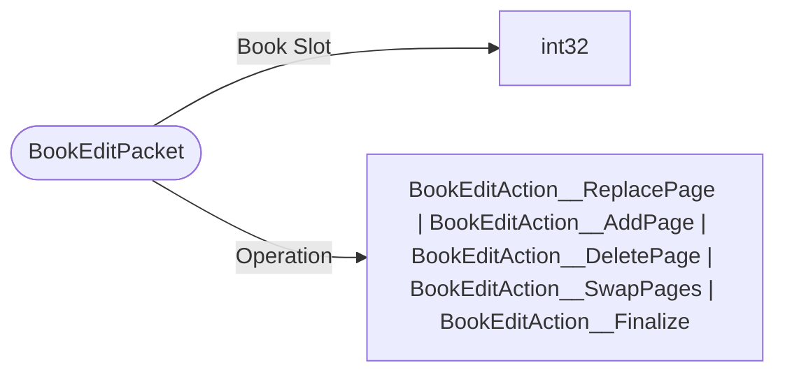

# BookEditPacket

`packet` - id **97**

```mermaid
flowchart LR
  ROOT(["BookEditPacket"])
  ROOT -->|"Book Slot"| int32["int32"]
  ROOT -->|"Operation"| BookEditAction__ReplacePage___BookEditAction__AddPage___BookEditAction__DeletePage___BookEditAction__SwapPages___BookEditAction__Finalize["BookEditAction__ReplacePage | BookEditAction__AddPage | BookEditAction__DeletePage | BookEditAction__SwapPages | BookEditAction__Finalize"]
```

