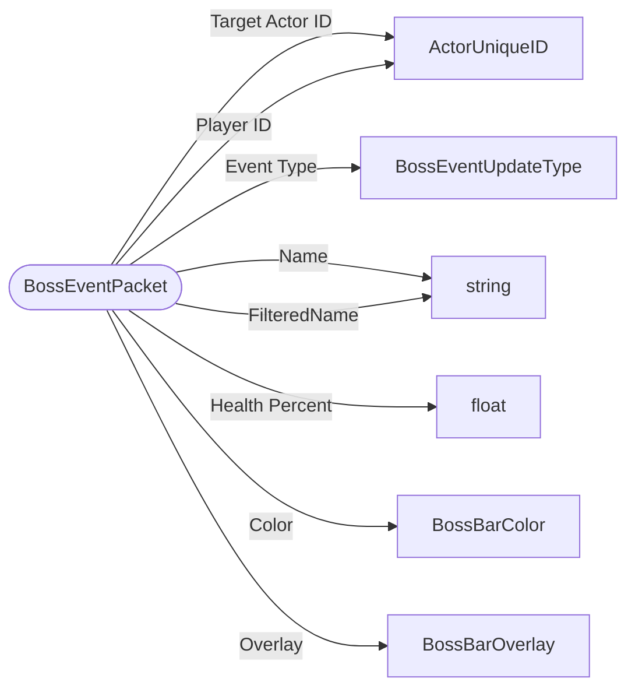

# BossEventPacket

`packet` - id **74**

```mermaid
flowchart LR
  ROOT(["BossEventPacket"])
  ROOT -->|"Target Actor ID"| ActorUniqueID["ActorUniqueID"]
  ROOT -->|"Player ID"| ActorUniqueID["ActorUniqueID"]
  ROOT -->|"Event Type"| BossEventUpdateType["BossEventUpdateType"]
  ROOT -->|"Name"| string["string"]
  ROOT -->|"FilteredName"| string["string"]
  ROOT -->|"Health Percent"| float["float"]
  ROOT -->|"Color"| BossBarColor["BossBarColor"]
  ROOT -->|"Overlay"| BossBarOverlay["BossBarOverlay"]
```

