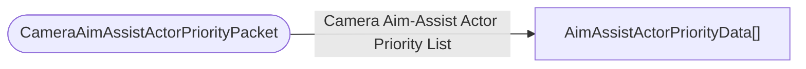

# CameraAimAssistActorPriorityPacket

`packet` - id **339**

	Sent by the server to clients for updating the actor priority for client aim-assist systems.
	

```mermaid
flowchart LR
  ROOT(["CameraAimAssistActorPriorityPacket"])
  ROOT -->|"Camera Aim-Assist Actor Priority List"| AimAssistActorPriorityData["AimAssistActorPriorityData[]"]
```

