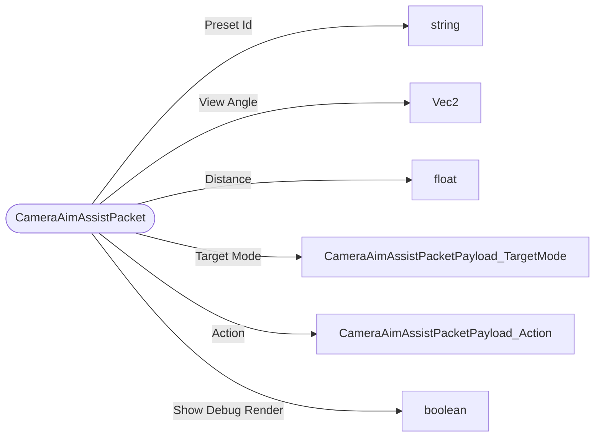

# CameraAimAssistPacket

`packet` - id **316**

- protocol: 2168
- minecraft: 1.26.40

```mermaid
flowchart LR
  ROOT(["CameraAimAssistPacket"])
  ROOT -->|"Preset Id"| string["string"]
  ROOT -->|"View Angle"| Vec2["Vec2"]
  ROOT -->|"Distance"| float["float"]
  ROOT -->|"Target Mode"| CameraAimAssistPacketPayload_TargetMode["CameraAimAssistPacketPayload_TargetMode"]
  ROOT -->|"Action"| CameraAimAssistPacketPayload_Action["CameraAimAssistPacketPayload_Action"]
  ROOT -->|"Show Debug Render"| boolean["boolean"]
```

