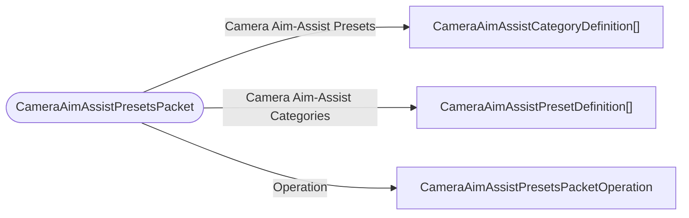

# CameraAimAssistPresetsPacket

`packet` - id **320**

- protocol: 2168
- minecraft: 1.26.40

	Sent by the server to clients for initializing and updating the client aim-assist registry.
	AddToExisting operations are sent by the server when new presets/categories are added to the registry through creator facing APIs.
	

