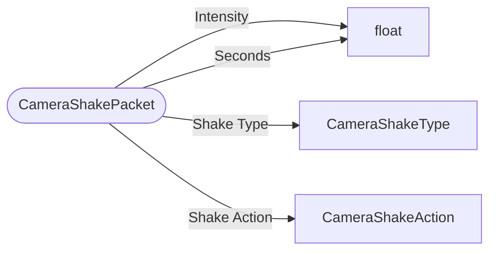

# CameraShakePacket

`packet` - id **159**

It may be used to queue or stop a camera shake

```mermaid
flowchart LR
  ROOT(["CameraShakePacket"])
  ROOT -->|"Intensity"| float["float"]
  ROOT -->|"Seconds"| float["float"]
  ROOT -->|"Shake Type"| CameraShakeType["CameraShakeType"]
  ROOT -->|"Shake Action"| CameraShakeAction["CameraShakeAction"]
```

