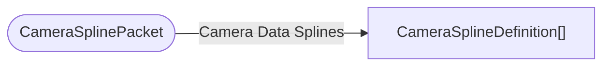

# CameraSplinePacket

`packet` - id **338**

	Sent by the server to clients for initializing custom spline data that can be played later through the camera command.
	

```mermaid
flowchart LR
  ROOT(["CameraSplinePacket"])
  ROOT -->|"Camera Data Splines"| CameraSplineDefinition["CameraSplineDefinition[]"]
```

