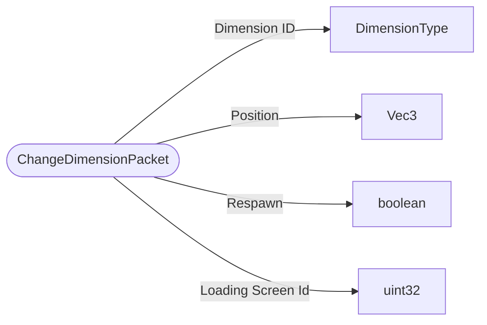

# ChangeDimensionPacket

`packet` - id **61**

- protocol: 2168
- minecraft: 1.26.40

```mermaid
flowchart LR
  ROOT(["ChangeDimensionPacket"])
  ROOT -->|"Dimension ID"| DimensionType["DimensionType"]
  ROOT -->|"Position"| Vec3["Vec3"]
  ROOT -->|"Respawn"| boolean["boolean"]
  ROOT -->|"Loading Screen Id"| uint32["uint32"]
```

