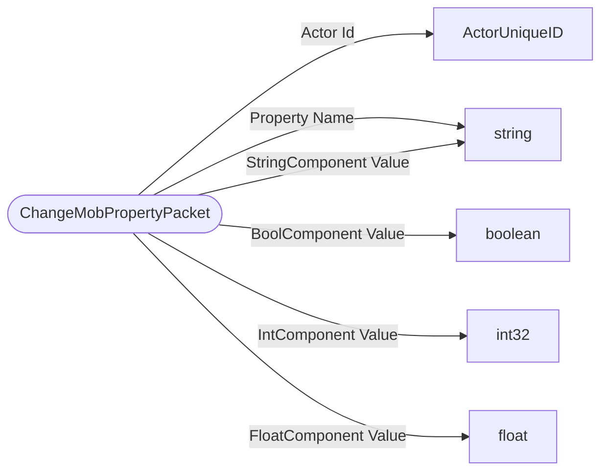

# ChangeMobPropertyPacket

`packet` - id **182**

- protocol: 2168
- minecraft: 1.26.40

```mermaid
flowchart LR
  ROOT(["ChangeMobPropertyPacket"])
  ROOT -->|"Actor Id"| ActorUniqueID["ActorUniqueID"]
  ROOT -->|"Property Name"| string["string"]
  ROOT -->|"BoolComponent Value"| boolean["boolean"]
  ROOT -->|"StringComponent Value"| string["string"]
  ROOT -->|"IntComponent Value"| int32["int32"]
  ROOT -->|"FloatComponent Value"| float["float"]
```

