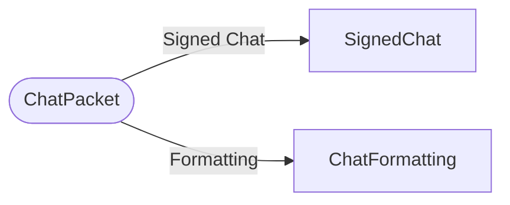

# ChatPacket

`packet` - id **361**

Carries a Chat Service signature that receiving clients verify. The hosting server relays the signed block unmodified and may only decorate around it.

```mermaid
flowchart LR
  ROOT(["ChatPacket"])
  ROOT -->|"Signed Chat"| SignedChat["SignedChat"]
  ROOT -->|"Formatting"| ChatFormatting["ChatFormatting"]
```

