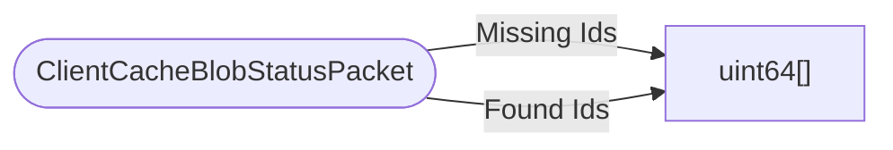

# ClientCacheBlobStatusPacket

`packet` - id **135**

- protocol: 2168
- minecraft: 1.26.40

Sent periodically by the client to update the server on which blob it has (ACK) and which blobs it is lacking (MISS).

