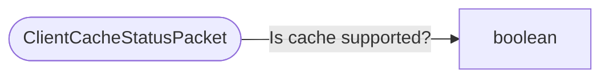

# ClientCacheStatusPacket

`packet` - id **129**

- protocol: 2168
- minecraft: 1.26.40

Sent by the Client once, at login, to communicate if it supports the client blob cache protocol or not.
	  Documented in <a href=https://github.com/Mojang/bedrock-docs/blob/master/GameplaySystems/ClientBlobCacheProtocol.md>https://github.com/Mojang/bedrock-docs/blob/master/GameplaySystems/ClientBlobCacheProtocol.md</a>

