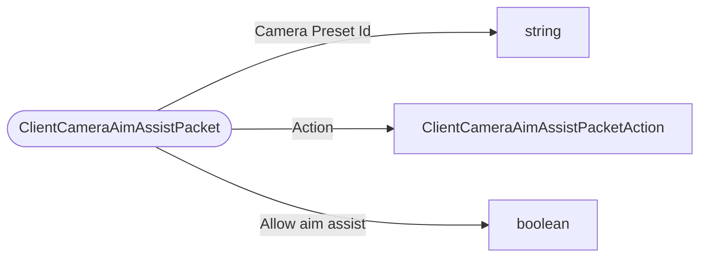

# ClientCameraAimAssistPacket

`packet` - id **321**

	Sent by clients to the server for activating/deactivating aim-assist.
	Activation uses the CameraPreset Id for server-side lookup and uses its aim_assist field
	for aim-assist activation settings.
	

