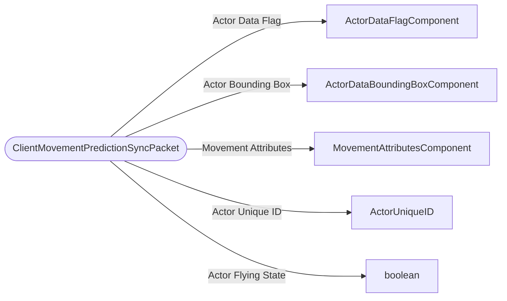

# ClientMovementPredictionSyncPacket

`packet` - id **322**

Only used in Server-Authoritative Movement. Sent periodically if the client has received corrections from the server. Contains information about client-predictions that are relevant to movement.

