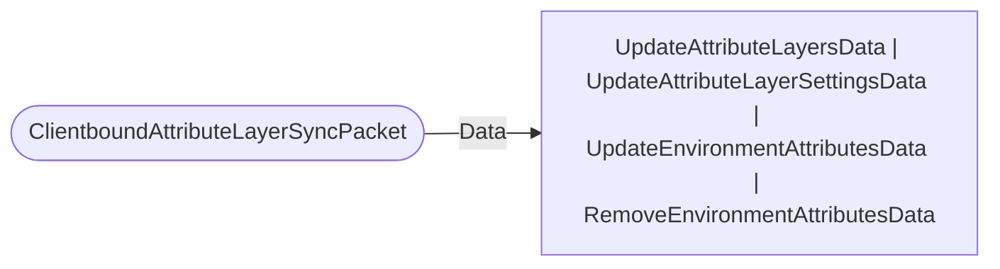

# ClientboundAttributeLayerSyncPacket

`packet` - id **345**

```mermaid
flowchart LR
  ROOT(["ClientboundAttributeLayerSyncPacket"])
  ROOT -->|"Data"| UpdateAttributeLayersData___UpdateAttributeLayerSettingsData___UpdateEnvironmentAttributesData___RemoveEnvironmentAttributesData["UpdateAttributeLayersData | UpdateAttributeLayerSettingsData | UpdateEnvironmentAttributesData | RemoveEnvironmentAttributesData"]
```

