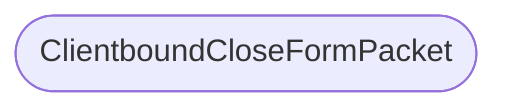

# ClientboundCloseFormPacket

`packet` - id **310**

This will only have an affect if the client currently has a server form on the UI stack.

```mermaid
flowchart LR
  ROOT(["ClientboundCloseFormPacket"])
```

