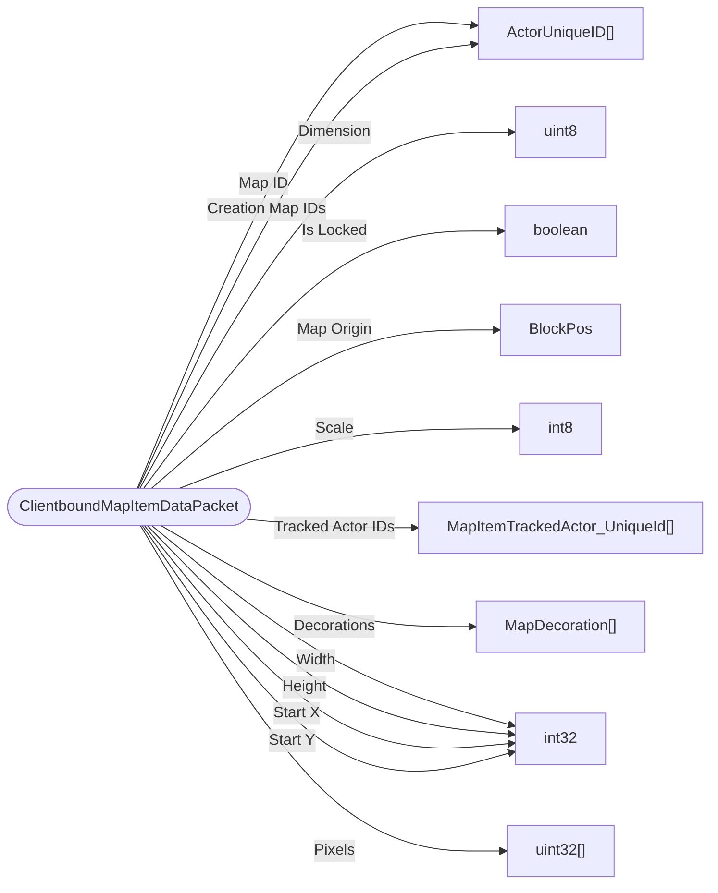

# ClientboundMapItemDataPacket

`packet` - id **67**

- protocol: 2168
- minecraft: 1.26.40

```mermaid
flowchart LR
  ROOT(["ClientboundMapItemDataPacket"])
  ROOT -->|"Map ID"| ActorUniqueID["ActorUniqueID"]
  ROOT -->|"Dimension"| uint8["uint8"]
  ROOT -->|"Is Locked"| boolean["boolean"]
  ROOT -->|"Map Origin"| BlockPos["BlockPos"]
  ROOT -->|"Creation Map IDs"| ActorUniqueID["ActorUniqueID[]"]
  ROOT -->|"Scale"| int8["int8"]
  ROOT -->|"Tracked Actor IDs"| MapItemTrackedActor_UniqueId["MapItemTrackedActor_UniqueId[]"]
  ROOT -->|"Decorations"| MapDecoration["MapDecoration[]"]
  ROOT -->|"Width"| int32["int32"]
  ROOT -->|"Height"| int32["int32"]
  ROOT -->|"Start X"| int32["int32"]
  ROOT -->|"Start Y"| int32["int32"]
  ROOT -->|"Pixels"| uint32["uint32[]"]
```

